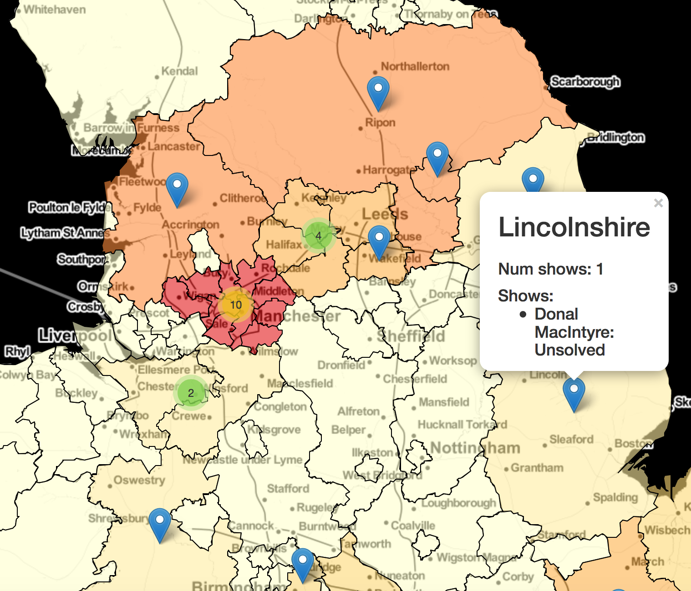

# Detective Map

You don't need to have read Orwell to know the UK may be obsessed with murder, having outputted over 100 murder mystery TV shows through the decades. Spread across the UK, from big cities to twee countryside locations, let's check there's not a UK murder mystery show in each county...

This is based on a list of shows provided by [Wikipedia](https://en.wikipedia.org/wiki/Category:British_detective_television_series) and [IMDB](https://www.imdb.com/list/ls023545027/).  I looked at:

- Using Spacy to get locations from the Wikipedia API, and then mapping these to counties with a [lookup table](https://www.paulstenning.com/uk-towns-and-counties-list/)
- Using a curated dataset

The map indicates how many shows are in each county.  Click on a marker in a county to see a popover providing a list of shows.  You can view the map [here](map.html).

